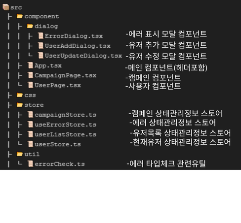

# wiseBrids 사전과제 프로젝트

이 프로젝트는 **wiseBrids** 사전과제를 위한 웹 애플리케이션입니다. 본 프로젝트는 **React**와 **TypeScript**로 개발되었으며, **Tailwind CSS**와 **Zustand**를 사용하여 스타일링과 상태 관리를 처리했습니다.

## 사용 기술 스택

- **React**: 사용자 인터페이스(UI) 구현을 위한 라이브러리
- **TypeScript**: JavaScript의 타입을 강화한 언어
- **Tailwind CSS**: CSS 프레임워크
- **Zustand**: 상태 관리 라이브러리

## 프로젝트 실행

이 프로젝트를 실행하려면 아래 명령어들을 순차적으로 실행하세요:

1. 의존성 설치
   ```bash
   npm install
2. 개발서버 실행
   ```bash
   npm start

## 프로젝트 디렉토리 구조



